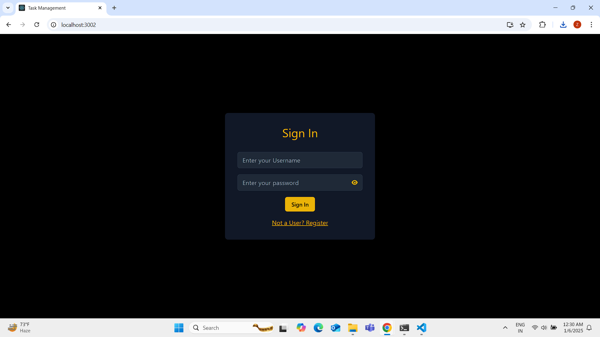
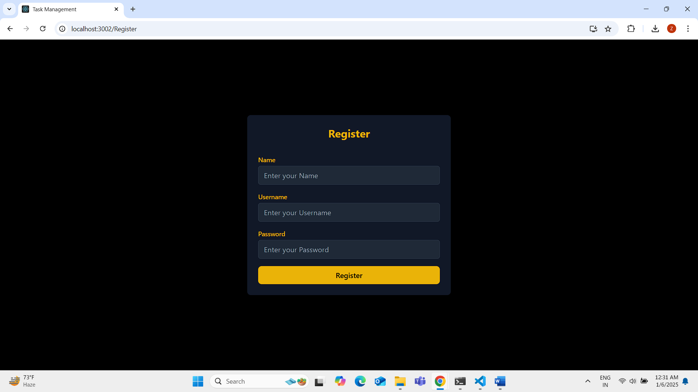
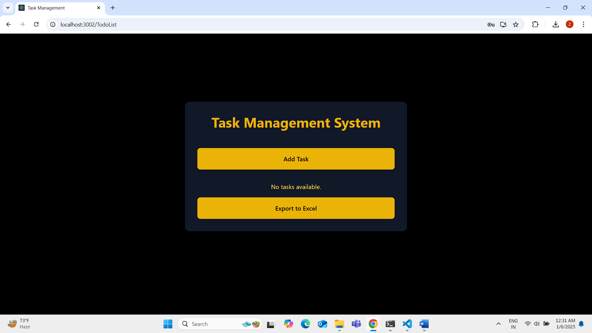
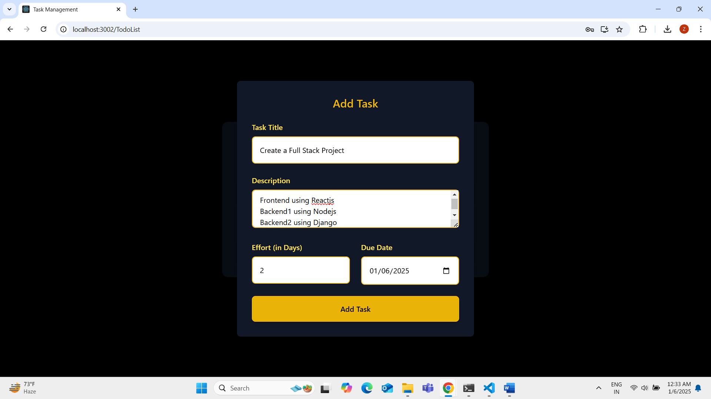
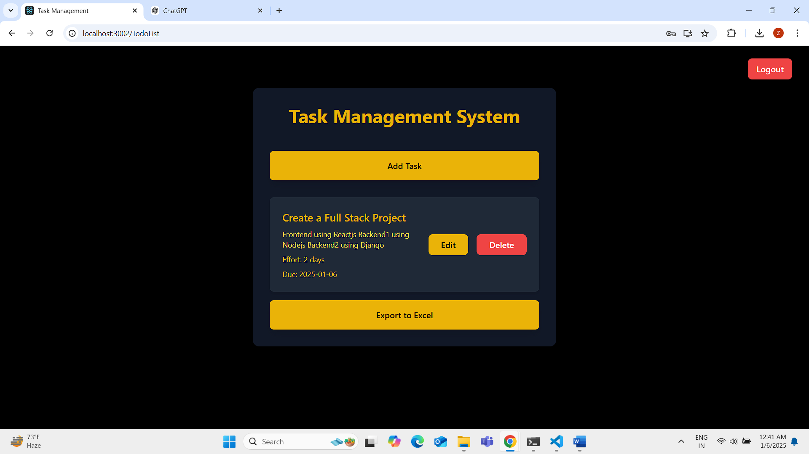
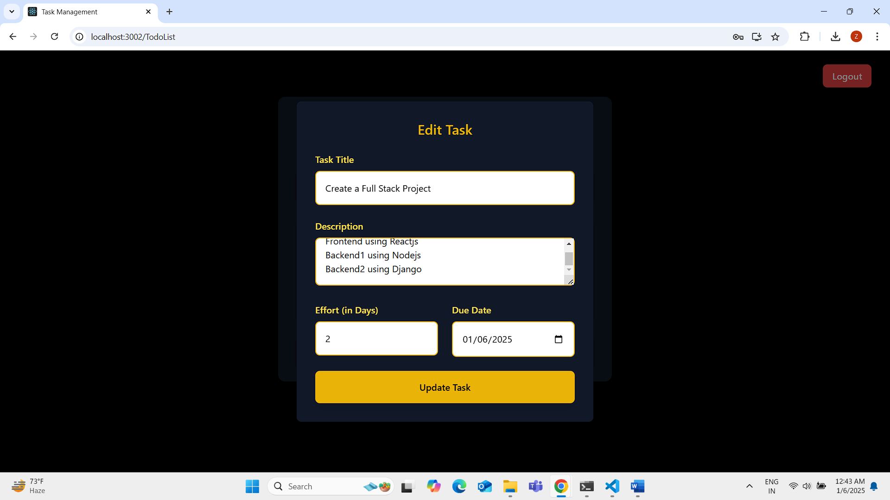
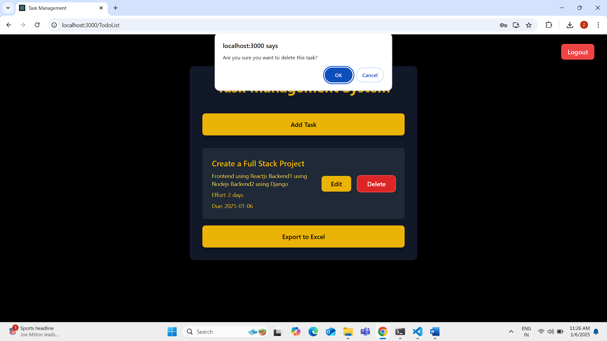
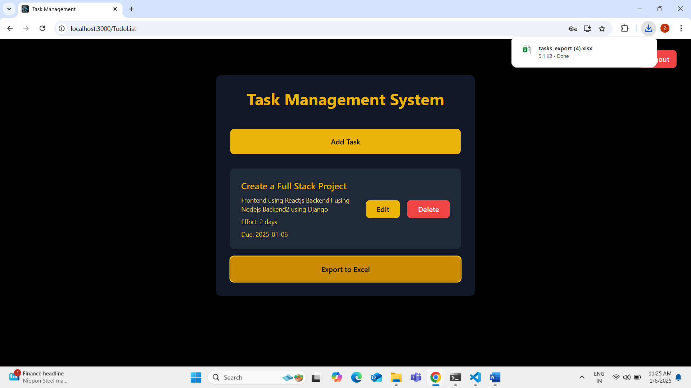
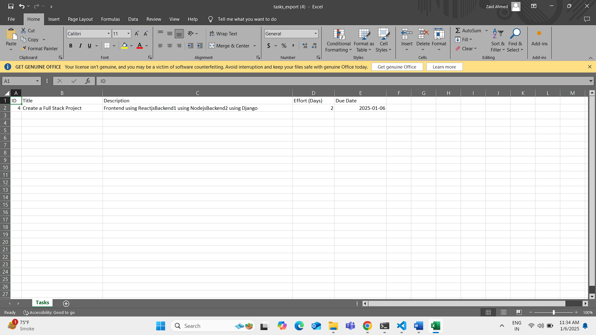

# TaskManagement Project

A full-stack task management application built with React, Node.js, and Django. The project consists of three main components: a React frontend and two backend implementations (Node.js and Django) offering different functionality.

## Project Structure

```
TaskManagement/
├── frontend/     # React frontend application
├── backend1/     # Node.js backend implementation
└── backend2/     # Django backend implementation
```

### First Start django server and run migrations so that user table will be created and in nodejs registeration would be done

## Frontend Setup (React)

### Prerequisites
- Node.js (v14.0.0 or higher)
- npm (v6.0.0 or higher)

### Installation Steps
1. Navigate to the frontend directory:
   ```bash
   cd frontend
   ```

2. Install dependencies:
   ```bash
   npm install
   ```

3. Start the development server:
   ```bash
   npm start
   ```

The application will be available at `http://localhost:3000`

## Environment Variables

NOTE JWT_SECRET should be same as SECRET_KEY in django for authentication of token
### Backend 1 (Node.js)
Create a `.env` file in the backend1 directory with:
```
PORT=5000
JWT_SECRET=your_django_secret_key
```

### Backend 2 (Django)
Create a `.env` file in the backend2 directory with:
```
DEBUG=True
SECRET_KEY=your_django_secret_key
```
### Frontent (React.js)
Create a `.env` file in the frontend directory with:
```
REACT_APP_BACKEND_DJANGO_API=http://localhost:8000/api/tasks/
REACT_APP_BACKEND_NODEJS_API=http://localhost:5000/api/v1/user/
```

## Backend 2 Setup (Django)

### Prerequisites
- Python (v3.8 or higher)
- pip (Python package manager)

### Installation Steps
1. Navigate to the backend2 directory:
   ```bash
   cd backend2
   ```

2. Create and activate a virtual environment:
   ```bash
   python -m venv env
   
   # On Windows
   .\env\Scripts\activate
   
   # On macOS/Linux
   source env/bin/activate
   ```

3. Install dependencies:
   ```bash
   pip install -r requirements.txt
   ```

4. Create a `.env` file in the backend2 directory with the following variables:
   ```
   DEBUG=True
   SECRET_KEY=your_django_secret_key
   DATABASE_URL=your_database_url
   ```

5. Run migrations:
   ```bash
   python manage.py makemigrations
   python manage.py migrate
   ```

6. Start the Django development server:
   ```bash
   python manage.py runserver
   ```

The Django server will run on `http://localhost:8000`

## Backend 1 Setup (Node.js)

### Prerequisites
- Node.js (v14.0.0 or higher)
- npm (v6.0.0 or higher)

### Installation Steps
1. Navigate to the backend1 directory:
   ```bash
   cd backend1
   ```

2. Install dependencies:
   ```bash
   npm install
   ```

3. Create a `.env` file in the backend1 directory with the following variables:
   ```
   PORT=5000
   MONGODB_URI=your_mongodb_connection_string
   JWT_SECRET=your_jwt_secret
   ```

4. Start the server:
   ```bash
   node index.js
   ```

The Node.js server will run on `http://localhost:5000`


### The login page



### The Register Page



## Task Management Page



## Add a Task 



## When Task is Saved



### Updating the Task



### Deleting the Task



### Export to Excel



### Excel Image


